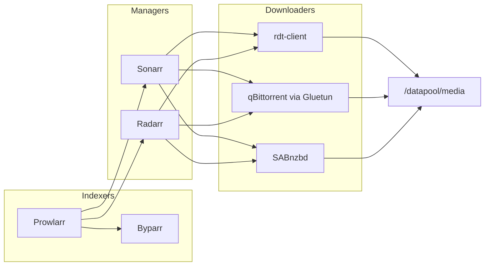
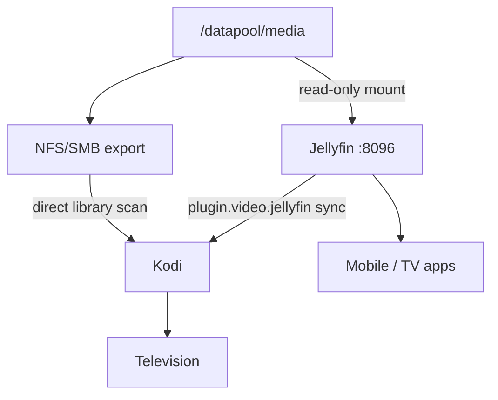

# R&Dtv Architecture & Tutorial

> **Audience:** administrators, household operators, and developers who need to
> understand how R&Dtv, Kodi, floor2, and Jellyfin fit together.
>
> **Scope:** this document synthesizes the repository, the reference floor2
> deployment at `192.168.1.206`, and the operational notes in
> [`JELLYFIN.md`](JELLYFIN.md), [`SETUP-GUIDE.md`](SETUP-GUIDE.md), and
> [`RDTV_TEST_CHEATSHEET.md`](RDTV_TEST_CHEATSHEET.md).
>
> **View HTML on your machine** (not the cloud agent VM):
> - No server: `./radtv docs --open`
> - With server: `./radtv docs` then open `http://127.0.0.1:8765/ARCHITECTURE.html`

---

## Table of contents

1. [What is R&Dtv?](#1-what-is-rdtv)
2. [What is floor2?](#2-what-is-floor2)
3. [The big picture](#3-the-big-picture)
4. [Layer-by-layer breakdown](#4-layer-by-layer-breakdown)
5. [How media flows through the system](#5-how-media-flows-through-the-system)
6. [Kodi: the living-room frontend](#6-kodi-the-living-room-frontend)
7. [Jellyfin: the owned-library frontend](#7-jellyfin-the-owned-library-frontend)
8. [floor2: the media server](#8-floor2-the-media-server)
9. [Configuration: one file to rule them all](#9-configuration-one-file-to-rule-them-all)
10. [First-time setup tutorial](#10-first-time-setup-tutorial)
11. [Day-to-day operations](#11-day-to-day-operations)
12. [Legacy naming (badtv → radtv)](#12-legacy-naming-badtv--radtv)
13. [Security & credentials](#13-security--credentials)
14. [Troubleshooting](#14-troubleshooting)
15. [Further reading](#15-further-reading)

---

## 1. What is R&Dtv?

**R&Dtv** (née *B@Dtv*, originally *TerraKodi*) is TheClawFirm's pre-configured
Kodi distribution. It is **packaging software**—not a streaming service. R&Dtv
does not host, transmit, or mirror audiovisual content. Instead it:

- Installs and configures Kodi with a curated addon stack.
- Merges lawful free/ad-supported IPTV sources into a single playlist.
- Applies a **Black Donnellys**–inspired color theme (soot black, whiskey amber,
  deep emerald, brick red).
- Optionally wires a home NAS (floor2) and a self-hosted *arr + Jellyfin stack.
- Automates Real-Debrid, TorBox, Trakt, and VPN setup through a host-side
  bootstrap wizard (`./radtv setup`).

The project lives at [github.com/jimmershere/radtv](https://github.com/jimmershere/radtv)
and ships as GPL-3.0 software with no warranty. Read
[`DISCLAIMER.md`](../DISCLAIMER.md) before installing.

### What ships in the repo

| Path | Role |
|------|------|
| `radtv` / `bootstrap.py` | Host-side setup wizard (15+ steps, idempotent) |
| `build/wizard/` | In-Kodi maintenance wizard (`script.radtv.wizard`) |
| `build/repository/` | Kodi repo package (`repository.radtv`) |
| `iptv/` | Declarative IPTV source list + playlist builder |
| `config/radtv.conf.example` | Single source of truth for hosts, paths, toggles |
| `media-server/` | NFS/SMB setup scripts for the NAS |
| `tools/` | Repo packager, scraper catalog refresh, RD token rotator |
| `docs/` | Install guides, Jellyfin ops, this architecture doc |

---

## 2. What is floor2?

**floor2** is TheClawFirm's reference media server: an 8 TB ZFS box on the LAN
at **`192.168.1.206`**. It is not a product name inside Kodi—it is the
operational hostname for the NAS that stores owned media and runs the Docker
*arr stack.

floor2 plays three roles:

1. **Storage backbone** — ZFS dataset `/datapool/media` holds movies, TV,
   music, photos, and download staging directories.
2. **Automation hub** — Docker Compose runs Prowlarr, Sonarr, Radarr,
   rdt-client, qBittorrent (+ Gluetun VPN), SABnzbd, Byparr, and Jellyfin.
3. **Network share** — NFS and/or SMB exports let Kodi clients browse the
   library directly without going through Jellyfin.

The name "floor2" appears throughout config (`FLOOR2_HOST`, wizard menu items)
but every path is overridable—point R&Dtv at any NAS by editing
`config/radtv.conf`.

### floor2 at a glance

| Property | Value |
|----------|-------|
| LAN IP | `192.168.1.206` |
| SSH user | `floor2` (bootstrap) / `radtv` (NFS config example) |
| ZFS pool | `datapool` |
| Media dataset | `/datapool/media` (also exported as `/media` mount) |
| Docker stack root | `/datapool/preserved/badtv-arr` *(legacy name)* |
| Jellyfin URL | `http://192.168.1.206:8096` |

---

## 3. The big picture

R&Dtv splits work across **three machines/concerns**:

```text
┌─────────────────────────────────────────────────────────────────────────┐
│  KODI CLIENT (TV box, laptop, LibreELEC)                                  │
│  ┌─────────────┐  ┌──────────────┐  ┌─────────────┐  ┌────────────────┐  │
│  │ Live TV     │  │ Free VOD     │  │ Scrapers    │  │ Owned library  │  │
│  │ (IPTV/PVR)  │  │ (Tubi/Pluto) │  │ (Umbrella…) │  │ (Jellyfin/NFS) │  │
│  └──────┬──────┘  └──────┬───────┘  └──────┬──────┘  └───────┬────────┘  │
│         │                │                 │                  │           │
│         └────────────────┴─────────────────┴──────────────────┘           │
│                                    │                                     │
│                          ./radtv setup (bootstrap)                       │
│                          script.radtv.wizard (maintenance)               │
└────────────────────────────────────┼─────────────────────────────────────┘
                                     │ LAN
┌────────────────────────────────────┼─────────────────────────────────────┐
│  FLOOR2 (192.168.1.206)            │                                     │
│                                    ▼                                     │
│  ┌──────────────────────────────────────────────────────────────────┐  │
│  │  ZFS: /datapool/media  →  movies/  tv/  music/  downloads/ …    │  │
│  └───────────────────────────────┬──────────────────────────────────┘  │
│                                  │                                      │
│  ┌───────────────┐  ┌────────────┴────────────┐  ┌──────────────────┐  │
│  │ NFS / SMB     │  │  Docker *arr stack      │  │  Jellyfin :8096  │  │
│  │ exports       │  │  Prowlarr Sonarr Radarr │  │  (read-only /media)│  │
│  │ /media/*      │  │  rdt-client qBit SAB  │  │                  │  │
│  └───────────────┘  └─────────────────────────┘  └──────────────────┘  │
└─────────────────────────────────────────────────────────────────────────┘
                                     │
                                     ▼
                          Internet indexers / debrid / Usenet
```

### Design philosophy (2026)

After Real-Debrid's May 2026 filename-keyword filter, R&Dtv v3 shifted strategy:

| Layer | Purpose |
|-------|---------|
| **Owned library** (*arr + Jellyfin) | Canonical, long-term media you control |
| **Usenet** (SABnzbd) | Stable acquisition without Cloudflare games |
| **TorBox** | Parallel debrid refuge alongside Real-Debrid |
| **Scrapers** (Umbrella, Jacktook) | Supplemental discovery layered *over* the owned library |
| **Free IPTV** | Lawful linear TV (Pluto, Plex Live, Samsung TV+, Stirr, iptv-org) |

Jellyfin is the **presentation layer** for owned media. Sonarr/Radarr and
download clients are the **writers**. Kodi remains the lean local-TV +
scraper frontend, optionally syncing Jellyfin's library via
`plugin.video.jellyfin`.

---

## 4. Layer-by-layer breakdown

### 4.1 Host bootstrap (`./radtv setup`)

`bootstrap.py` is a stdlib-only Python TUI that walks a fresh Linux box from
zero to a Kodi kiosk. State is persisted in `~/.config/radtv/state.json`; each
step is idempotent and skippable on re-run.

**Step order** (v3.1 fork):

| # | Step ID | What it does |
|---|---------|--------------|
| 1 | `disclaimer` | Legal gate |
| 2 | `apt` | Installs Kodi + binary addons, mpv, wireguard, nftables |
| 3 | `kodi_userdata` | Creates `~/.kodi/userdata`, writes `advancedsettings.xml` |
| 4 | `vpn` | WireGuard + kill-switch (optional) |
| 5 | `radtv_addons` | Stages `repository.radtv` zip |
| 6 | `install_official` | YouTube, Pluto TV, PlexMod, Arctic Zephyr skin from Kodi mirrors |
| 7 | `grey_addons` | ResolveURL, Umbrella, Seren, POV, CocoScrapers |
| 8 | `cleanup` | Prunes zombie addons (The Crew, Crackle) + orphaned FlareSolverr |
| 9 | `floor2` | SSHFS mount + Kodi `sources.xml` entries |
| 10 | `prowlarr` | Deploys full Docker stack on floor2 |
| 11 | `usenet` | SABnzbd + NZB indexer wiring (optional) |
| 12 | `jellyfin` | Jellyfin container + API provisioning + Kodi sync addon |
| 13 | `elementum` | Elementum + Jacktook torrent clients in Kodi |
| 14 | `pvr` | PVR IPTV Simple Client → bundled `radtv.m3u` |
| 15 | `skin` | Applies `radtv` color override |
| 16 | `realdebrid` | Device-code OAuth |
| 17 | `torbox` | API key for TorBox |
| 18 | `trakt` | Device-code OAuth |
| 19 | `stream_test` | mpv smoke-test of one IPTV channel |
| 20 | `launch` | Kodi `--standalone -fs` kiosk mode |

Subcommands:

```bash
./radtv status              # which steps completed
./radtv repair <step>       # re-run one step (e.g. jellyfin, prowlarr)
./radtv launch              # start Kodi only
./radtv setup --force       # redo everything
```

### 4.2 In-Kodi wizard (`script.radtv.wizard`)

After bootstrap, the wizard runs in **maintenance mode** from
**Programs → R&Dtv Wizard**. It does *not* repeat the heavy install—it handles
couch-friendly tasks:

- Show / install third-party scrapers from the live catalog
- Refresh scraper catalog from GitHub
- Check anonymizer (public IP) status
- Add floor2 NFS media sources
- Re-apply R&Dtv theme
- Run library scan

First-run setup always happens on the host via `./radtv setup`.

### 4.3 IPTV pipeline

The `iptv/` directory builds a merged live-TV playlist:

1. `sources.yaml` — declarative list of M3U + XMLTV sources (Pluto, Plex Live,
   Samsung TV+, Stirr, iptv-org categories).
2. `build-playlist.py` — fetches, deduplicates, writes `dist/radtv.m3u` +
   `dist/radtv.xml`.
3. PVR IPTV Simple Client — Kodi's live TV engine reads the playlist.

Build locally:

```bash
make iptv
# or: python3 iptv/build-playlist.py
```

Open **TV → Guide** in Kodi after PVR is configured; EPG populates within a
minute.

### 4.4 floor2 Docker stack

Bootstrap deploys (or updates) this Compose file at
`/datapool/preserved/radtv-arr/docker-compose.yml` on floor2:

| Container | Port | Role |
|-----------|------|------|
| `radtv-prowlarr` | 9696 | Indexer manager; syncs to Sonarr/Radarr |
| `radtv-byparr` | 8191 | Cloudflare bypass (FlareSolverr-API compatible) |
| `radtv-sonarr` | 8989 | TV acquisition → `/media/tv` |
| `radtv-radarr` | 7878 | Movie acquisition → `/media/movies` |
| `radtv-rdtclient` | 6500 | Real-Debrid download client |
| `radtv-gluetun` | — | VPN sidecar for qBittorrent |
| `radtv-qbittorrent` | 8091 | Torrent client (network through Gluetun) |
| `radtv-sabnzbd` | 8080 | Usenet download client |
| `radtv-jellyfin` | 8096, 8920 | Media server (profile-gated; read-only `/media`) |

> **Legacy containers on the live floor2 box** may still use the `badtv-*`
> prefix (e.g. `badtv-jellyfin`). The bootstrap template uses `radtv-*`. Both
> refer to the same stack root. See [§12](#12-legacy-naming-badtv--radtv).

### 4.5 Network access to floor2 media

Kodi can reach owned media two ways:

| Method | Protocol | Setup | Best for |
|--------|----------|-------|----------|
| **Direct NFS/SMB** | `nfs://192.168.1.206/media/...` | `media-server/setup-nfs.sh` + wizard | Local scraping, Elementum writes |
| **SSHFS mount** | `~/floor2-media` | `./radtv repair floor2` | Elementum download path on client |
| **Jellyfin sync** | HTTP API → Kodi DB | `./radtv repair jellyfin` | Unified metadata, multi-device |

NFS is preferred on Linux/LibreELEC; SMB on Windows.

---

## 5. How media flows through the system

### 5.1 Acquisition (getting media onto floor2)



1. **Prowlarr** aggregates indexers (torrent + Usenet). **Byparr** solves
   Cloudflare challenges for indexer sites.
2. **Sonarr** / **Radarr** monitor wanted shows/movies and send grabs to
   download clients.
3. **rdt-client** pulls cached torrents through Real-Debrid.
4. **qBittorrent** (via **Gluetun** VPN) handles torrents RD rejects.
5. **SABnzbd** handles Usenet—the most stable 2026 path.
6. Completed files land under `/datapool/media/movies`, `/datapool/media/tv`,
   etc.

### 5.2 Playback (getting media to your screen)



- **Jellyfin** indexes `/media` read-only and serves browsers, phones, Roku,
  Apple TV, etc.
- **Kodi + Jellyfin addon** syncs Jellyfin's library into Kodi's local video
  database—scrapers then layer on top.
- **Kodi + NFS** scans files directly—useful when Jellyfin is down or for
  music/photos.

### 5.3 Streaming without owned media

For content you don't own, Kodi uses:

| Source | Mechanism |
|--------|-----------|
| Live TV | PVR IPTV Simple → `radtv.m3u` (11k+ free channels) |
| Free VOD | Tubi, Pluto TV, YouTube addons |
| Premium links | Umbrella/Seren/POV → Real-Debrid or TorBox |
| Torrents | Jacktook/Elementum → Prowlarr indexers or Stremio aggregators |

---

## 6. Kodi: the living-room frontend

### Addon tiers

| Tier | Examples | Install |
|------|----------|---------|
| Core binary | `inputstream.adaptive`, `pvr.iptvsimple` | apt / bootstrap |
| Official VOD | YouTube, Pluto TV, PlexMod | bootstrap from Kodi mirrors |
| Grey scrapers | Umbrella, Seren, POV, ResolveURL | bootstrap grey_addons step |
| Torrent | Elementum, Jacktook | bootstrap elementum step |
| Library sync | Jellyfin for Kodi | bootstrap jellyfin step |
| Maintenance | script.radtv.wizard | repository.radtv zip |

### Key userdata files

| File | Purpose |
|------|---------|
| `userdata/sources.xml` | NFS/SMB paths to floor2 |
| `userdata/advancedsettings.xml` | Refresh rates, scan behavior |
| `userdata/addon_data/pvr.iptvsimple/settings.xml` | M3U + EPG URLs |
| `userdata/addon_data/script.module.resolveurl/settings.xml` | Real-Debrid tokens |
| `addons/<skin>/colors/radtv.xml` | Black Donnellys theme |

### Recommended library folder layout

```text
/media/
├── Movies/     Movie Name (Year)/Movie Name (Year).mkv
├── TV/         Show Name/Season 01/Show Name - s01e01.mkv
├── Music/
└── Photos/
```

---

## 7. Jellyfin: the owned-library frontend

### Role

Jellyfin is the **owned-library frontend** for the *arr-managed tree. It
provides:

- Web UI at `http://192.168.1.206:8096`
- Native apps (iOS, Android, Roku, Apple TV, Samsung, etc.)
- User management, transcoding, remote LAN playback
- Kodi sync via `plugin.video.jellyfin`

### Provisioned libraries (reference floor2)

| Library | Path inside container |
|---------|----------------------|
| Movies | `/media/movies` |
| Shows | `/media/tv` |

The media mount is **read-only** (`/datapool/media:/media:ro`). Sonarr/Radarr
own writes; Jellyfin owns presentation.

### Bootstrap provisioning

When you opt in during `./radtv setup`, `step_jellyfin`:

1. Starts the Jellyfin container (`docker compose --profile jellyfin up -d`).
2. Creates admin user, Movies + Shows libraries, API key via Jellyfin REST API.
3. Installs `plugin.video.jellyfin` into Kodi and pre-seeds the server
   connection (no pairing dialog on first launch).

Resume or re-run:

```bash
./radtv repair jellyfin
```

### Kodi ↔ Jellyfin sync

After sync, Kodi's video database mirrors Jellyfin's owned library. Umbrella
and Jacktook become **supplemental scrapers** over that base—not the only way
to find content. This is "move #4" from the 2026 grey-area streaming plan.

Manual fallback if the addon schema changes:

1. Install Jellyfin Kodi repository from `repo.jellyfin.org`.
2. Install **Jellyfin for Kodi**.
3. Point at `http://192.168.1.206:8096`.
4. Sign in with credentials from the floor2 handover file (see §13).

---

## 8. floor2: the media server

### ZFS layout

```text
datapool/
├── media/                    # Primary library (NFS export: /media)
│   ├── movies/
│   ├── tv/
│   ├── music/
│   ├── photos/             # via FLOOR2_SUBDIRS
│   ├── downloads/          # rdt-client staging
│   ├── qbit-downloads/
│   └── usenet/
└── preserved/
    └── badtv-arr/            # Docker stack (legacy dirname)
        ├── docker-compose.yml
        ├── docker-compose.override.yml
        ├── prowlarr/  sonarr/  radarr/  …
        └── jellyfin/
            ├── config/
            ├── cache/
            └── rdtv-admin.json   # credential handover (0600)
```

### NFS / SMB setup

On floor2:

```bash
sudo bash media-server/setup-nfs.sh    # or setup-smb.sh
```

Both scripts read `config/radtv.conf` (or defaults from
`config/radtv.conf.example`), create the ZFS dataset if missing, and append
exports idempotently.

On each Kodi client:

```bash
bash install.sh    # merges floor2 entries into sources.xml
# or: wizard → "Add floor2 NFS media sources"
```

### SSHFS client mount

`step_floor2` on the Kodi host:

- Generates `~/.ssh/floor2_mount` keypair
- Authorizes it on floor2
- Mounts `/datapool/media` → `~/floor2-media`
- Installs a systemd user unit for auto-mount
- Writes Kodi `sources.xml` entries

This path exists primarily so **Elementum** can write completed downloads back
to floor2 from the client.

---

## 9. Configuration: one file to rule them all

Copy and edit:

```bash
cp config/radtv.conf.example config/radtv.conf
$EDITOR config/radtv.conf
```

Key variables:

| Variable | Default | Meaning |
|----------|---------|---------|
| `FLOOR2_HOST` | `192.168.1.206` | NAS IP or hostname |
| `FLOOR2_USER` | `radtv` | SSH/SMB user |
| `FLOOR2_ZFS_DATASET` | `datapool/media` | ZFS dataset path |
| `FLOOR2_MOUNTPOINT` | `/media` | Export mount point |
| `FLOOR2_SUBDIRS` | Movies TV Music Photos | Library folders |
| `RADTV_SKIN_TARGET` | `arctic-zephyr-reloaded` | Theme target skin |
| `IPTV_INCLUDE_*` | `1` | IPTV category toggles |
| `ENABLE_REAL_DEBRID` | `1` | Wizard prompts for RD |

`config/load.sh` layers `radtv.conf` over the example and exports all
`RADTV_*`, `FLOOR2_*`, `IPTV_*`, `KODI_*`, `ENABLE_*` variables for shell
scripts.

---

## 10. First-time setup tutorial

### Prerequisites

- Kodi 19+ (Matrix / Nexus / Omega)
- Python 3.10+ on the build machine
- Debian/Ubuntu: install binary Kodi addons (see [`INSTALL.md`](INSTALL.md))
- Unknown sources enabled in Kodi
- SSH access to floor2 (if using NAS / *arr stack)

### Path A — full automated setup (recommended)

```bash
git clone https://github.com/jimmershere/radtv.git
cd radtv
cp config/radtv.conf.example config/radtv.conf   # edit FLOOR2_HOST if needed
./radtv setup
```

Walk through the prompts. Non-blocking steps (floor2 SSH, Prowlarr, Usenet,
Jellyfin) can be skipped and resumed later.

After setup:

1. **Programs → R&Dtv Wizard** for maintenance tasks.
2. Open **TV → Guide** to confirm IPTV.
3. If Jellyfin was enabled, check **Add-ons → Jellyfin** sync status.
4. Browse to `http://192.168.1.206:8096` from any LAN browser.

### Path B — NAS-only (no *arr stack)

```bash
# On floor2:
sudo bash media-server/setup-nfs.sh

# On Kodi client:
bash install.sh
# Restart Kodi; wizard → "Add floor2 NFS media sources"
# Files → Add videos → Browse → NFS → import Movies/TV
```

### Path C — Jellyfin on existing floor2 stack

If floor2 already runs the `badtv-arr` compose stack:

```bash
./radtv repair jellyfin
```

Or manually:

```bash
ssh floor2@192.168.1.206 \
  'cd /datapool/preserved/badtv-arr && docker compose up -d jellyfin'
```

Then install Jellyfin for Kodi and point at `:8096`.

### Path D — Windows client

```powershell
git clone https://github.com/jimmershere/radtv.git
cd radtv
pwsh ./install.ps1
```

Host bootstrap (`./radtv setup`) is Linux-focused; Windows users typically
use `install.ps1` + the in-Kodi wizard.

---

## 11. Day-to-day operations

### Health checks

From a trusted machine with SSH to floor2:

```bash
ssh floor2@192.168.1.206 'cd /datapool/preserved/badtv-arr && docker compose ps'
ssh floor2@192.168.1.206 'docker ps --filter name=jellyfin --format "{{.Names}} {{.Status}}"'
```

See [`RDTV_TEST_CHEATSHEET.md`](RDTV_TEST_CHEATSHEET.md) for the full smoke-test
checklist.

### Common repair commands

```bash
./radtv repair prowlarr     # redeploy / rewire indexer stack
./radtv repair usenet       # SABnzbd + NZB indexer
./radtv repair jellyfin     # Jellyfin + Kodi sync
./radtv repair floor2       # SSHFS mount + sources
./radtv repair realdebrid   # re-authorize RD OAuth
```

### Real-Debrid token rotation

Post-May-2026, RD OAuth tokens expire in ~24 hours. Run daily:

```bash
./tools/rd-refresh.py
# cron: 0 5 * * * /path/to/radtv/tools/rd-refresh.py
```

This refreshes tokens in ResolveURL, scraper addons, rdt-client on floor2, and
`~/.config/radtv/state.json`.

### Scraper catalog maintenance

Third-party repos die constantly. R&Dtv auto-probes them:

- [`tools/refresh-scrapers.py`](../tools/refresh-scrapers.py) — manual refresh
- GitHub Actions daily workflow — commits updated catalog
- Wizard fetches live catalog on open (24h cache)

### Media quality audit

Before importing a large library into Kodi:

```bash
bash tools/scan-existing-media.sh /media media-scan-report.tsv
bash tools/quality-check.sh media-scan-report.tsv
```

---

## 12. Legacy naming (badtv → radtv)

The GitHub/product migration renamed everything public-facing, but **floor2
operational state** keeps legacy names:

| Context | Old name | New name |
|---------|----------|----------|
| GitHub repo | `jimmershere/badtv` | `jimmershere/radtv` |
| Host command | `./badtv` | `./radtv` |
| Kodi repo addon | `repository.badtv` | `repository.radtv` |
| IPTV output | `badtv.m3u` | `radtv.m3u` |
| floor2 compose path | `/datapool/preserved/badtv-arr` | *(unchanged on server)* |
| floor2 containers | `badtv-jellyfin`, etc. | `radtv-*` in bootstrap template |

Do not rename floor2 paths without a planned maintenance window, backups, and
service migration. See [`MIGRATION.md`](MIGRATION.md).

---

## 13. Security & credentials

### Rules

- **Never** commit Jellyfin passwords, API keys, or RD tokens to Git.
- The floor2 handover file lives only on the server:
  `/datapool/preserved/badtv-arr/jellyfin/rdtv-admin.json`
- Expected permissions: mode `0600`, owner `floor2`, group `floor2`.
- Retrieve credentials over trusted SSH or a password manager—never paste into
  chat, shell history, screenshots, or issue trackers.
- If exposed, rotate Jellyfin admin password + API key immediately.

### Handover file contents (structure only)

```json
{
  "url": "http://192.168.1.206:8096",
  "admin_user": "...",
  "admin_password": "...",
  "api_key": "..."
}
```

### VPN

Bootstrap can configure WireGuard with an nftables kill-switch. The wizard's
**Check anonymizer status** action verifies your public IP before streaming.
See [`PRIVACY.md`](PRIVACY.md).

### qBittorrent VPN

Gluetun routes all qBittorrent traffic through Mullvad/Proton/ExpressVPN.
Until `.env` credentials are filled, Gluetun restart-loops (expected).

---

## 14. Troubleshooting

| Symptom | Likely cause | Fix |
|---------|--------------|-----|
| Jellyfin unreachable | Container down | `docker compose up -d jellyfin`; check logs |
| Empty Movies/Shows | No media in `/datapool/media/*` | Add content; run library scan in Jellyfin |
| IPTV guide empty | EPG fetch failed | Re-run `make iptv`; check network |
| RD "Bad token" | 24h token expiry | `./tools/rd-refresh.py` |
| qBit no network | Gluetun not healthy | Fill VPN creds in stack `.env` |
| Prowlarr 403 on indexers | Cloudflare | Confirm Byparr running on :8191 |
| NFS mount fails | Export missing | Re-run `media-server/setup-nfs.sh` |
| Kodi can't find scrapers | Repo dead | Wizard → refresh catalog; pick `ok` repo |
| `badtv-*` vs `radtv-*` containers | Legacy deployment | Both valid; bootstrap cleanup removes orphans |

Full checklist: [`RDTV_TEST_CHEATSHEET.md`](RDTV_TEST_CHEATSHEET.md).

---

## 15. Further reading

| Document | Topic |
|----------|-------|
| [`INSTALL.md`](INSTALL.md) | Install paths (fast / manual / Windows) |
| [`SETUP-GUIDE.md`](SETUP-GUIDE.md) | Human-readable wizard walkthrough |
| [`JELLYFIN.md`](JELLYFIN.md) | Jellyfin ops on floor2 |
| [`ADDON-LIST.md`](ADDON-LIST.md) | Full addon reference |
| [`SCRAPERS.md`](SCRAPERS.md) | Self-maintaining scraper catalog |
| [`MIGRATION.md`](MIGRATION.md) | badtv → radtv migration |
| [`PRIVACY.md`](PRIVACY.md) | VPN / DNS / anonymizer |
| [`media-server/README.md`](../media-server/README.md) | NFS/SMB NAS setup |
| [`iptv/README.md`](../iptv/README.md) | Live TV pipeline |
| [`CHANGELOG.md`](../CHANGELOG.md) | Version history |

---

*Generated as part of the R&Dtv documentation pass. For corrections, open an
issue or PR at [github.com/jimmershere/radtv](https://github.com/jimmershere/radtv).*
